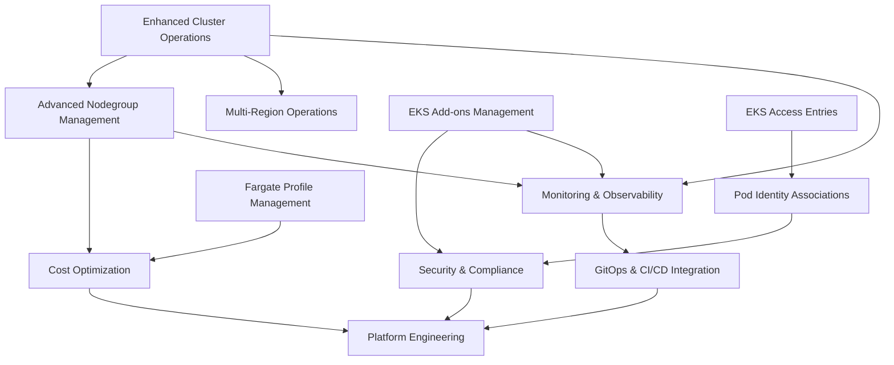

# Refresh Tool Feature Tracking

*Master tracking file for all feature development*  
*Current Version: v0.1.9*  
*Updated: 2025-08-06*

## Feature Status Overview

### Phase 1: Core Operations Enhancement (v0.2.x)
*Target Release: Q1 2025 | Priority: HIGH*

| Feature | Status | Effort | AWS APIs | Dependencies | Champion |
|---------|--------|--------|-----------|-------------|----------|
| Enhanced Cluster Operations | ✅ Complete (Phase 1 scope) | L | EKS, EC2, IAM | None | TBD |
| Advanced Nodegroup Management | 🚧 In Progress | XL | EKS, EC2, ASG, CW, Pricing | Cluster Ops | TBD |
| EKS Add-ons Management | 🚧 In Progress | M | EKS | None | TBD |

### Phase 2: Identity & Security (v0.3.x)  
*Target Release: Q2 2025 | Priority: HIGH*

| Feature | Status | Effort | AWS APIs | Dependencies | Champion |
|---------|--------|--------|-----------|-------------|----------|
| EKS Access Entries | 📋 Not Started | M | EKS, IAM | None | TBD |
| Pod Identity Associations | 📋 Not Started | M | EKS, IAM | Access Entries | TBD |
| Security & Compliance | 📋 Not Started | XL | EKS, Config, KMS | Pod Identity | TBD |

### Phase 3: Advanced Operations (v0.4.x)
*Target Release: Q3 2025 | Priority: MEDIUM*

| Feature | Status | Effort | AWS APIs | Dependencies | Champion |
|---------|--------|--------|-----------|-------------|----------|
| Fargate Profile Management | 📋 Not Started | M | EKS, IAM | None | TBD |
| Cost Optimization & Analysis | 📋 Not Started | XL | Cost Explorer, Pricing, CW | Nodegroup Mgmt | TBD |
| Multi-Region Operations | 📋 Not Started | L | EKS (multi-region) | Cluster Ops | TBD |
| Monitoring & Observability | 📋 Not Started | XL | CloudWatch, X-Ray | All Phase 1 | TBD |

### Phase 4: Platform Features (v0.5.x)
*Target Release: Q4 2025 | Priority: LOW*

| Feature | Status | Effort | AWS APIs | Dependencies | Champion |
|---------|--------|--------|-----------|-------------|----------|
| EKS Auto Mode Support | 📋 Not Started | M | EKS (new APIs) | TBD | TBD |
| GitOps & CI/CD Integration | 📋 Not Started | XL | EKS, CodeCommit, CodePipeline | Monitoring | TBD |
| Platform Engineering | 📋 Not Started | XL | EKS, Organizations | All Previous | TBD |

## Legend
- **Status**: 📋 Not Started | 🚧 In Progress | ✅ Complete | ⚠️ Blocked | 📄 Specification Only
- **Effort**: S (1-2 weeks) | M (3-4 weeks) | L (5-8 weeks) | XL (9+ weeks)
- **Priority**: HIGH (must have) | MEDIUM (should have) | LOW (nice to have)

## AWS SDK Dependencies by Phase

### Current Dependencies (v0.1.9)
```go
"github.com/aws/aws-sdk-go-v2/service/autoscaling"
"github.com/aws/aws-sdk-go-v2/service/cloudwatch" 
"github.com/aws/aws-sdk-go-v2/service/ec2"
"github.com/aws/aws-sdk-go-v2/service/eks"
"github.com/aws/aws-sdk-go-v2/service/ssm"
"github.com/aws/aws-sdk-go-v2/service/sts"
```

### Phase 1 Additions (v0.2.x)
```go
"github.com/aws/aws-sdk-go-v2/service/iam"           // Enhanced cluster/nodegroup ops
// removed for now
```

### Phase 2 Additions (v0.3.x)
```go
"github.com/aws/aws-sdk-go-v2/service/configservice" // Compliance checking
"github.com/aws/aws-sdk-go-v2/service/kms"          // Encryption audit
"github.com/aws/aws-sdk-go-v2/service/accessanalyzer" // Access analysis
```

### Phase 3 Additions (v0.4.x)
```go
"github.com/aws/aws-sdk-go-v2/service/costexplorer"  // Cost analysis
"github.com/aws/aws-sdk-go-v2/service/pricing"      // Pricing data (in use for Phase 1)
"github.com/aws/aws-sdk-go-v2/service/xray"         // Distributed tracing
"github.com/aws/aws-sdk-go-v2/service/applicationinsights" // App monitoring
```

### Phase 4 Additions (v0.5.x)
```go
"github.com/aws/aws-sdk-go-v2/service/codecommit"   // GitOps integration
"github.com/aws/aws-sdk-go-v2/service/codepipeline" // CI/CD integration
"github.com/aws/aws-sdk-go-v2/service/organizations" // Multi-account ops
```

## Feature Dependency Graph



## Performance Benchmarks

### Target Performance

| Operation | Typical Time | Target | Goal |
|-----------|--------------|--------|------|
| List clusters | ~3-5 seconds | 1-2 seconds | Faster |
| Cluster details | ~2-3 seconds | ~1 second | Faster |
| Nodegroup list | ~3-5 seconds | 1-2 seconds | Faster |
| Add-on operations | ~2-5 minutes | 30-60 seconds | Faster |
| Scaling operations | ~3-10 minutes | 1-3 minutes | Faster |

### Success Criteria
- ✅ **Performance**: Meet or exceed all benchmark targets
- ✅ **Reliability**: 99.9% success rate for operations
- ✅ **User Experience**: <5 second response time for all list operations
- ✅ **Error Handling**: Clear, actionable error messages for all failure scenarios

## Development Roadmap Timeline

### Q1 2025 (Phase 1 - Core Operations)
- **Month 1**: Enhanced Cluster Operations + EKS Add-ons Management
- **Month 2**: Advanced Nodegroup Management (Part 1)
- **Month 3**: Advanced Nodegroup Management (Part 2) + Testing

### Q2 2025 (Phase 2 - Identity & Security)
- **Month 4**: EKS Access Entries + Pod Identity Associations
- **Month 5**: Security & Compliance (Part 1)
- **Month 6**: Security & Compliance (Part 2) + Integration Testing

### Q3 2025 (Phase 3 - Advanced Operations)
- **Month 7**: Fargate Profile Management + Multi-Region Operations
- **Month 8**: Cost Optimization & Analysis (Part 1)
- **Month 9**: Cost Optimization & Analysis (Part 2) + Monitoring & Observability (Part 1)

### Q4 2025 (Phase 4 - Platform Features) 
- **Month 10**: Monitoring & Observability (Part 2) + EKS Auto Mode Support
- **Month 11**: GitOps & CI/CD Integration
- **Month 12**: Platform Engineering + Final Integration

## Risk Assessment

### High Risk Items
- **Cost Explorer Integration**: Complex pricing calculations and forecasting
- **Multi-Region Operations**: Data consistency and performance challenges  
- **EKS Auto Mode**: New AWS feature, APIs may change
- **Security Compliance**: Comprehensive rule engine complexity

### Medium Risk Items
- **Pod Identity Associations**: Cutting-edge feature, limited documentation
- **GitOps Integration**: Multiple tool integrations (Flux, ArgoCD)
- **Performance Benchmarks**: Meeting aggressive performance targets

### Low Risk Items
- **Enhanced Cluster Operations**: Straightforward API extensions
- **EKS Add-ons Management**: Well-documented APIs
- **Fargate Profile Management**: Mature AWS feature

## User Personas & Priority

### Primary Users (Phase 1-2)
1. **DevOps Engineers** (40% of users)
   - Need: Fast, reliable cluster operations
   - Priority: Performance, health validation
   - Key Features: Cluster ops, nodegroup management, add-ons

2. **Site Reliability Engineers** (30% of users)  
   - Need: Operational visibility and security
   - Priority: Monitoring, security, compliance
   - Key Features: Security scanning, access management, monitoring

3. **Platform Engineers** (20% of users)
   - Need: Advanced operational capabilities
   - Priority: Cost optimization, multi-region support
   - Key Features: Cost analysis, platform management

### Secondary Users (Phase 3-4)
4. **Security Teams** (10% of users)
   - Need: Compliance and security posture
   - Priority: Security scanning, access controls
   - Key Features: Compliance checking, vulnerability assessment

## Success Metrics

### Adoption Metrics
- **Phase 1**: 1,000+ unique users, 50+ GitHub stars
- **Phase 2**: 5,000+ unique users, 200+ GitHub stars  
- **Phase 3**: 10,000+ unique users, 500+ GitHub stars
- **Phase 4**: 25,000+ unique users, 1,000+ GitHub stars

### Performance Metrics
- **API Response Times**: <2 seconds for list operations
- **Success Rate**: >99% for all operations
- **Error Recovery**: <30 seconds average retry success

### Quality Metrics
- **Test Coverage**: >90% for all features
- **Documentation Coverage**: 100% of CLI commands documented
- **User Satisfaction**: >4.5/5.0 rating on user surveys

## Feature Implementation Status

*This section will be updated as features are developed*

### Recently Completed Features
- ✅ **v0.1.9**: Man page installation system
- ✅ **v0.1.8**: Health check system with pre-flight validation
- ✅ **v0.1.7**: Real-time progress monitoring for AMI updates

### In Development
- 🚧 **EKS Add-ons Management**: list/describe/update implemented; bulk update/security scan pending

### Next Planned Features (by Priority)
1. **Enhanced Cluster Operations** - Foundation for all other features
2. **EKS Add-ons Management** - High user demand, quick wins
3. **Advanced Nodegroup Management** - Core value proposition

---

*This document is updated continuously as features are planned, developed, and released. All team members should reference this for current status and planning.*